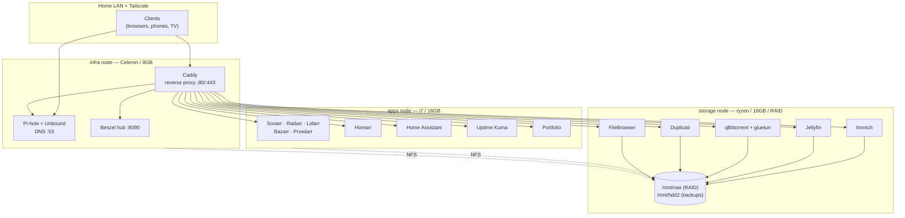
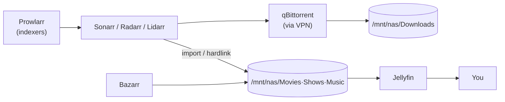

# Architecture

A three-node Docker-Compose homelab. Storage is centralized on **ryzen** and consumed over NFS; applications and infrastructure run on two smaller nodes. Everything is declared as code in this repo and deploys identically via CLI, Ansible, or Portainer.

## System overview

## Node responsibilities

| Node | Role | Why |
| --- | --- | --- |
| **ryzen** (storage) | Data + media services | Has the RAID array; keeps large/irreplaceable data local |
| **apps** | Applications | Most RAM; runs the media-automation suite + personal apps |
| **infra** | Edge & plumbing | Low-power; DNS, reverse proxy, monitoring, Tailscale |

Storage rule: **no irreplaceable data lives off ryzen.** App/infra nodes are disposable — rebuildable from this repo + a config restore.

## Media automation flow

Downloads and libraries share one volume (`/mnt/nas`) so imports are hardlinks, not copies.

## Storage & data flow

- **Config** (small, precious) → bind mount `${DOCKER_DATA}/<app>` (`/opt/homelab/data`) on each node, captured by per-stack `backup.sh`.
- **Media / bulk** → `/mnt/nas` (RAID on ryzen), served to other nodes via NFS.
- **Backups** → `/mnt/hdd2` on ryzen; Duplicati versions it off-site.

## Deployment model

The repo + plain `docker compose` is the source of truth. Portainer BE consumes the same folders as Git stacks (convenience + GUI rollback), but nothing depends on it — if the licence lapses, the CLI/Ansible path is unchanged.

## Toward Kubernetes

The layout maps cleanly to k3s later: each `stacks/<node>/<app>/` → a Helm chart, `.env` → ConfigMap/Secret, NFS → PersistentVolume/PVC, `homelab.*` labels → pod labels, the Caddyfile → an Ingress, and `homelab.node` → a nodeSelector. See [conventions.md](conventions.md).
