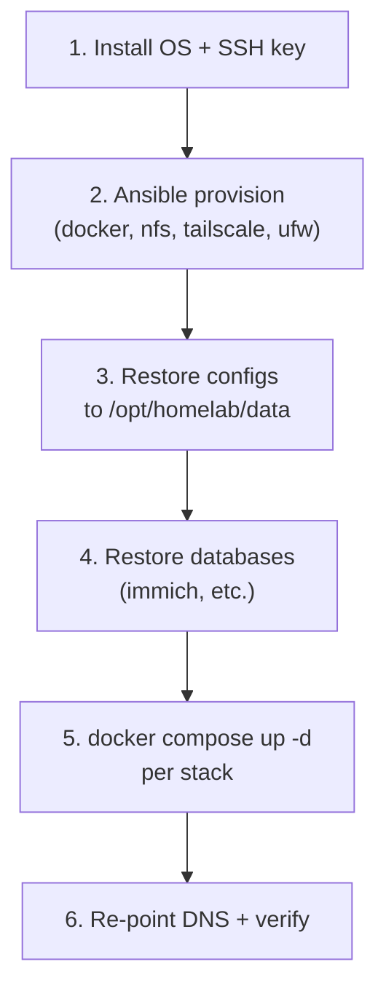

# Disaster recovery

How to recover from a lost container, a dead node, or a total rebuild.

## What is backed up, and where

| Data | Location | Protected by |
| --- | --- | --- |
| App configs & state | `/opt/homelab/data` | **restic** (`scripts/backup.sh`) → repo on `/mnt/hdd2/restic` — encrypted, deduplicated, versioned, per-host snapshots |
| Immich database | Postgres (on ryzen) | `pg_dumpall` dumped to `immich/db-dump/` and captured inside the restic snapshot |
| Media & documents | `/mnt/nas/{Gallery,Files,Drive}` | RAID mirror **+ restic `media` snapshot** on `/mnt/hdd2` (backed up from ryzen via `MEDIA_PATHS`). Add an off-site copy for true 3-2-1. |
| Infrastructure as code | this git repo | git remote |

**Test restores periodically** — an untested backup is a hope, not a plan.

## Scenario 1 — A single stack is broken

```bash
cd stacks/<node>/<app>
docker compose down
./restore.sh              # newest config archive (or ./restore.sh <file>)
docker compose up -d
```

## Scenario 2 — A disk in the RAID fails

Replace the disk and let the array rebuild (mdadm/ZFS). Media stays available during rebuild. If the whole array is lost, restore the media from the restic `media` snapshot (`sudo ./scripts/restore.sh <media-snapshot-id> --target /`, which recreates `/mnt/nas/{Gallery,Files,Drive}`) — provided `/mnt/hdd2` survived; otherwise from your off-site copy.

## Scenario 3 — Rebuild a node from zero



### Step by step

1. **OS + access.** Install Debian/Ubuntu, enable SSH, copy your key, set the static IP in `inventory.ini`.
2. **Provision.**
   ```bash
   cd ansible && ansible-galaxy collection install -r requirements.yml
   ansible-playbook site.yml --limit <node> -e tailscale_authkey=tskey-...
   ```
   (Rebuild **ryzen first** so NFS is up before apps/infra mount it.)
3. **Restore app state.** Pull everything under `/opt/homelab/data` back from restic in one shot:
   ```bash
   cd ~/homeServer
   cp .env.example .env && $EDITOR .env     # restore secrets, incl. RESTIC_PASSWORD + RESTIC_REPOSITORY
   make config                              # regenerate per-stack .env files
   make restore SNAP=latest                 # restores /opt/homelab/data from the repo
   ```
4. **Restore databases.**
   - **Immich:** the SQL dump comes back under `immich/db-dump/`. Bring Immich up, then `cd stacks/storage/immich && ./restore.sh` loads the newest `pg_dumpall`. The photo library on `/mnt/nas/Gallery` is RAID-protected and untouched.
5. **Deploy.** `docker compose up -d` in each stack (or re-add the Portainer Git stacks).
6. **Re-point the network.**
   - Router DHCP DNS → infra node IP (Pi-hole).
   - Confirm `ryzen`/`apps`/`infra` resolve (Tailscale MagicDNS).
   - Set `DOMAIN`/`ACME_EMAIL` in the Caddy stack; Caddy re-issues certificates automatically.

## Scenario 4 — Total loss (all nodes)

1. Clone this repo.
2. Rebuild **ryzen** (Scenario 3) — it holds the data and NFS exports.
3. Restore app state **and** `/mnt/nas` media from the restic repo if `/mnt/hdd2` survived; if it didn't, restore both from your off-site copy.
4. Rebuild **apps** and **infra**.
5. Restore each stack's config + databases, deploy, re-point DNS.

## Recovery verification checklist

- [ ] All containers `healthy` (`docker ps`)
- [ ] Immich loads and shows the library; a test upload works
- [ ] Jellyfin plays media
- [ ] *arr apps reach indexers (Prowlarr) and the download client
- [ ] DNS resolves + ad-blocking active (Pi-hole query log)
- [ ] Caddy serves each `app.${DOMAIN}` over HTTPS
- [ ] Beszel shows all nodes reporting
- [ ] A fresh `make backup CHECK=1` succeeds and `restic check` passes

## Keep off-box

Store these somewhere **not** on the homelab (password manager / encrypted vault):

- Each stack's `.env` (or at least the secrets)
- restic `RESTIC_PASSWORD` (without it the backups are unrecoverable)
- Immich `DB_PASSWORD`, Homarr `SECRET_ENCRYPTION_KEY`
- Tailscale auth keys, VPN (gluetun) credentials
