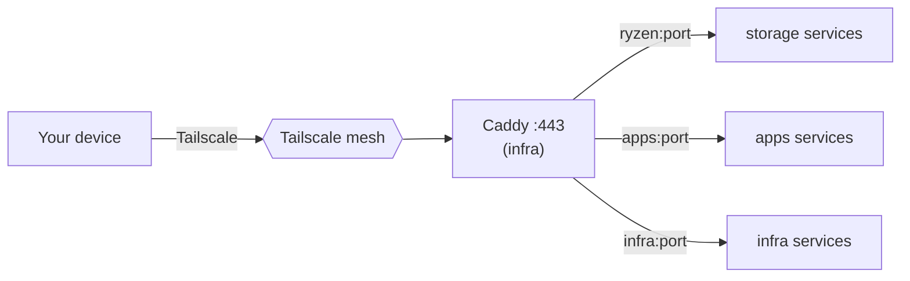
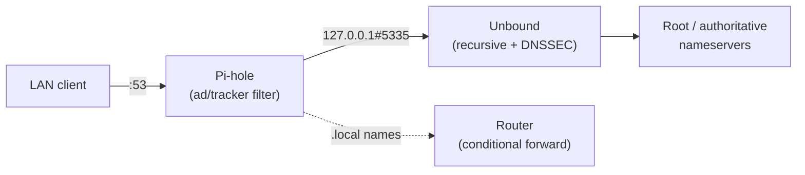

# Networking

## Access model

Two ways in, no services exposed to the public internet by default:

- **Tailscale** — a private mesh across all nodes + your devices. Remote access without port-forwarding.
- **Caddy** (infra node) — single reverse proxy terminating HTTPS and routing `app.${DOMAIN}` to the right node.

Cross-node traffic uses **published ports over the Tailscale/LAN interface** — Docker bridge networks are per-host, so a shared network can't span nodes. Caddy upstreams therefore point at node hostnames (`ryzen` / `apps` / `infra`), resolved via Tailscale MagicDNS or `/etc/hosts`.

## Reverse-proxy routes

| Subdomain | Upstream | Service |
| --- | --- | --- |
| `photos.${DOMAIN}` | `ryzen:2283` | Immich |
| `jellyfin.${DOMAIN}` | `ryzen:8096` | Jellyfin |
| `files.${DOMAIN}` | `ryzen:8082` | FileBrowser |
| `qbit.${DOMAIN}` | `ryzen:8080` | qBittorrent |
| `backup.${DOMAIN}` | `ryzen:8200` | Duplicati |
| `sonarr.${DOMAIN}` | `apps:8989` | Sonarr |
| `radarr.${DOMAIN}` | `apps:7878` | Radarr |
| `lidarr.${DOMAIN}` | `apps:8686` | Lidarr |
| `bazarr.${DOMAIN}` | `apps:6767` | Bazarr |
| `prowlarr.${DOMAIN}` | `apps:9696` | Prowlarr |
| `homarr.${DOMAIN}` | `apps:7575` | Homarr |
| `home.${DOMAIN}` | `apps:8123` | Home Assistant |
| `status.${DOMAIN}` | `apps:3001` | Uptime Kuma |
| `portfolio.${DOMAIN}` | `apps:3000` | Portfolio |
| `pihole.${DOMAIN}` | `infra:8081` | Pi-hole admin |
| `beszel.${DOMAIN}` | `infra:8090` | Beszel |

Routes live in [`stacks/infra/caddy/Caddyfile`](../stacks/infra/caddy/Caddyfile).

## Ports by node

| Node | TCP | UDP | Notes |
| --- | --- | --- | --- |
| **storage** | 111, 2049 (NFS); 2283, 8096, 8082, 8080, 8200 | 111, 2049 | Jellyfin uses host networking; qBittorrent 6881 = torrent |
| **apps** | 8989, 7878, 8686, 6767, 9696, 7575, 8123, 3001, 3000 | — | Home Assistant uses host networking |
| **infra** | 53, 80, 443, 8081, 8090 | 53 | 53 = DNS; 80/443 = Caddy |

The Ansible `common` role opens exactly these on the LAN (plus SSH) and allows everything on `tailscale0`. See [../ansible/group_vars/](../ansible/).

## DNS resolution

Pi-hole is the LAN's DNS server (set it as the DHCP DNS on your router). It filters ads/trackers, then forwards to a local recursive Unbound resolver — no third-party DNS.

## Firewall (UFW)

Default **deny incoming**, allow outgoing. Allowed in: SSH, everything on `tailscale0`, and the per-node service ports above (from the LAN CIDR only). Managed by the Ansible `common` role.
